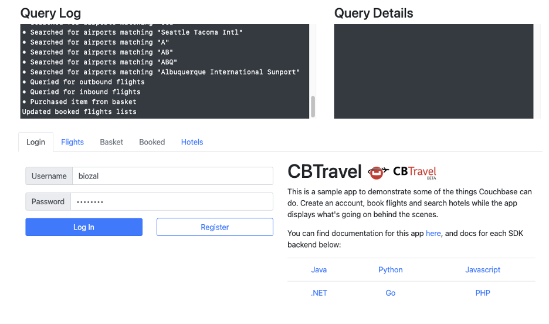
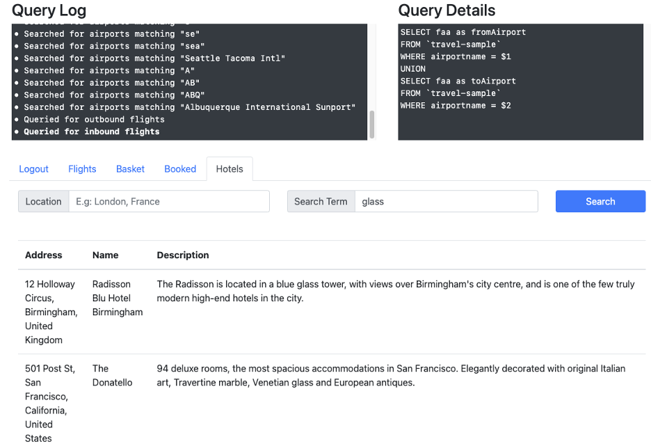
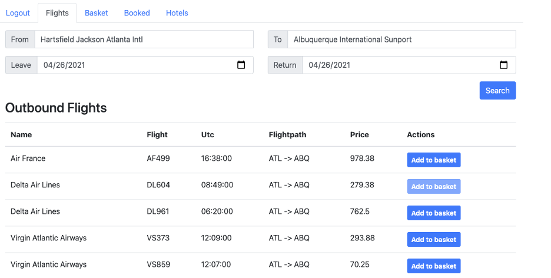
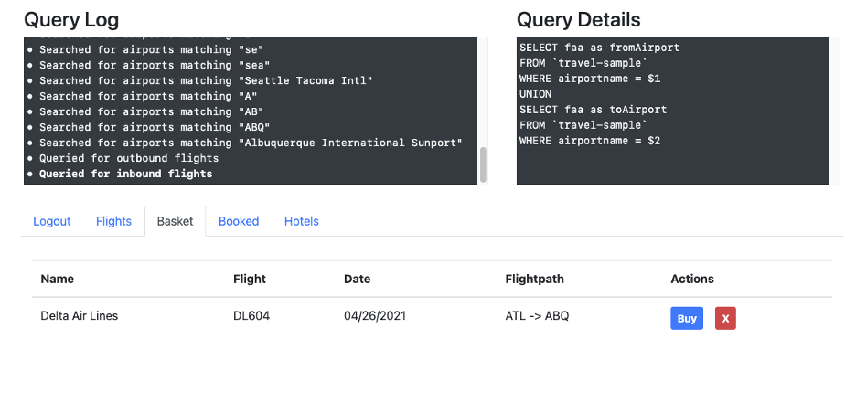
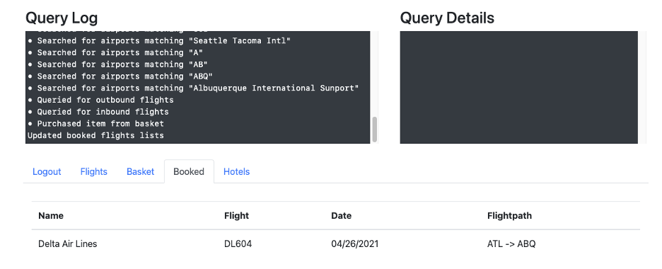

# Travel Sample Application 

### Specification

The purpose of this document is to describe the goals of the Travel Sample Application along with list the specification of how each of the sample applications should function.

## Features

### Login/Logout

#### Description

The goal of the Login/Logout is to give the user the ability to log into or out of the application.

#### Functionality

The application should only allow the Hotel search feature to work until the user logs into the application.  If the user tries to use the Flights, Basket, or Booked feature they should be warned that they aren’t logged into the application and until they do this they can’t use those features.

The user can put a value into the username and password box and hit the register button and it will register the user.  Once a user is registered then they can use that username and password to log into the application.

#### Queries

To-do add queries for login and logout

### Hotels

#### Description

The goal of hotels is to use the full text search to show a listing of hotels available in the database.  Note that this requires an index called hotels in order for the full text search to work.  Each application should validate that it exists and create it if it doesn’t.

#### Functionality

The functionality of these screens should be:
- Search by location
    - City, Country
- Search via term
    - Separate search term box that allows you to use full text search
- List the results of the search with the following fields
    - Address
    - Name
    - Description

#### Queries

The query should use the full text search by querying documents of type ‘hotel’ and look for values in the Location textbox and search for them from values in the the country, city, state, and address fields.

The Search Term text box should search the name and description fields.

### Flights

#### Description

The flights feature demos queries and joins by listing flights available and allow a user to book a flight that will put the flight into a shopping cart or basket.

#### Functionality

The functionality of these screens should be:

- Search from and to location based on the faa, icoa, or airport name
- Search on available flights based on dates based on routes
- Once search is done give listing of flights broken down by Outbound Flights and Returning Flights, fields should be
    - Name
    - Flight
    - UTC
    - Flightpath
    - Price
    - Action (add to basket)
- Once a flight is booked you need to use the basket or cart feature to purchase the flight and book it

#### Queries

The From and To textboxes should search for airport names based on the faa, icao, or airportname fields.

The leave and return date fields should query the schedule array to look for flights that are available by the day of the week provided in the leave or return field.  For example if they select 4/26/2021 - that is on a Tuesday so it should query all flights that the day of the flight is set to 2 (assuming that Sunday is day 0).

### Basket

#### Description

The basket allows you to list the flights that the user has added to the basket using the Flight screen. 

#### Functionality

The functionality of these screens should be listing of flights in the basket with the following fields:

- Name of Airline
- Flight Number
- Date
- Flightpath
- Actions
  - Buy
  - Remove
- Using the Buy action should book the flight 
- Using the Remote action should remove the flight from the booking screen

#### Queries

To-Do add queries

### Booked

#### Description

The goal of the booked feature is to show a listing of flights that are booked.

#### Functionality

The functionality of these screens should be a listing of booked flights.  Fields should include:

- Name of Airline
- Flight Number
- Date
- Flightpath
- Queries
- To-do add queries

